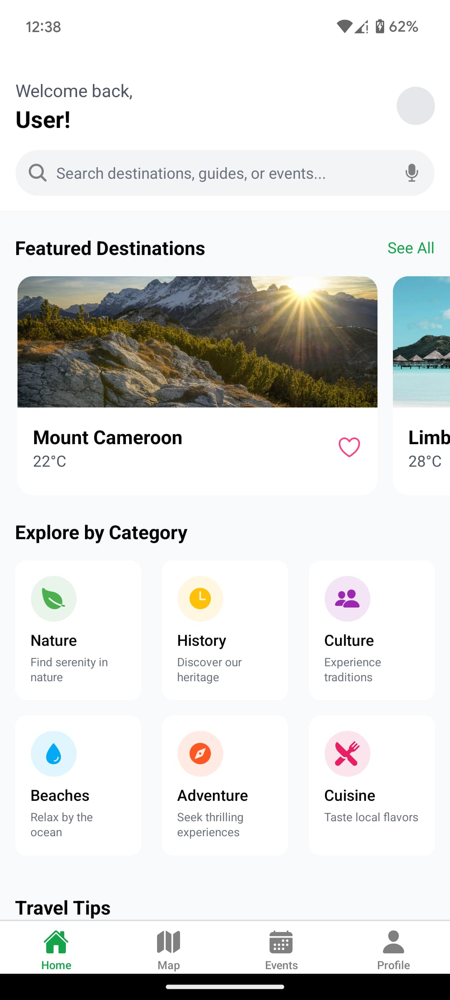
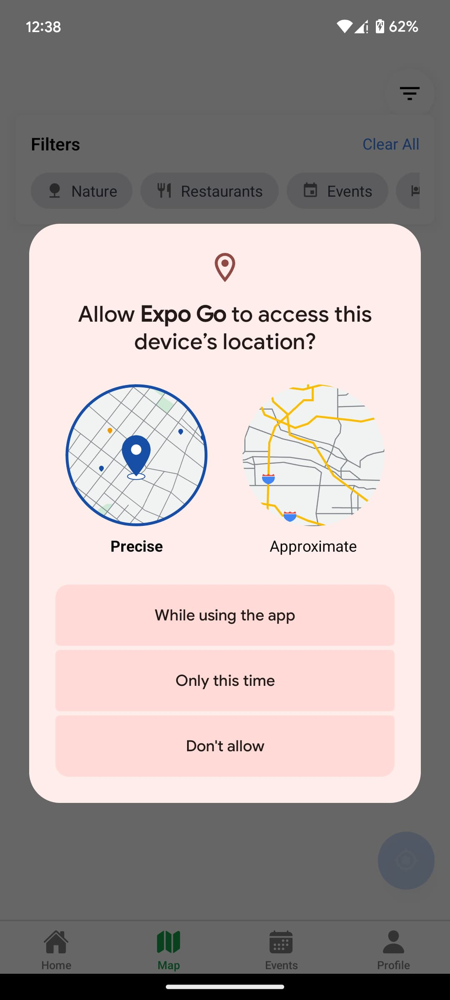

# Welcome to my Touristic site app 👋
 
 It was created to show case different beautiful touristic sites Cameroon have, Book events, get direction to them etc..

## Get started

1. Install dependencies

   ```bash
   npm install
   ```

2. Start the app

   ```bash
    npx expo start
   ```

In the output, you'll find options to open the app in a

- [development build](https://docs.expo.dev/develop/development-builds/introduction/)
- [Android emulator](https://docs.expo.dev/workflow/android-studio-emulator/)
- [iOS simulator](https://docs.expo.dev/workflow/ios-simulator/)
- [Expo Go](https://expo.dev/go), a limited sandbox for trying out app development with Expo

You can start developing by editing the files inside the **app** directory. This project uses [file-based routing](https://docs.expo.dev/router/introduction).

## Screens
- [Home]
- <div align="center">  </div>
- [Events] 
   <div align="center">  </div>
   
   <div align="center">  </div>
- [Map] 
   <div align="center">  </div>

## Notes
   There app is not completed just the front end have been developed, More modifications are Coming soon.
   Just the front end.


## Contact

Feel free to reach out with feedback or inquiries:

- **Email**: [e.bryandze@gmail.com]
- **X** : [https://x.com/dze_bryan]
- **LinkedIn**: [www.linkedin.com/in/dzebryan237]
- **GitHub**: [https://github.com/G-Bryan237]

---
